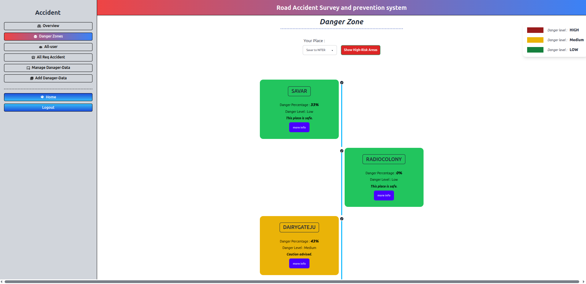

# Accident Prevention System 🚦🛣️

A full-stack web application built to identify, visualize, and manage accident-prone areas across different locations. The platform helps users and administrators track real-time accident reports, analyze danger zones, and make informed travel decisions.

🔗 **Live Website**: [Accident Prevention System](https://accident-prevention-system1.web.app/)

---

## 🚀 Key Features

- **Danger Zone Visualization**: Select a route and view dangerous areas on a graphical interface, with the ability to explore detailed accident records per location.
- **Role-Based Dashboards**: 
  - **User Dashboard**: Submit accident reports with full details (date, time, vehicle type, image, location, etc.).
  - **Admin Dashboard**: Approve/reject user-submitted reports, add new danger zones, manage users, and control accident statistics.
- **Accident Insights**: Click “More Info” on any route to view all related accidents with individual accident details like damage parts, cost, and deaths.
- **Real-Time Statistics**: Dynamic display of accident count, total cost, and severity for each place.
- **Authentication & Security**: Firebase-based social login (Google) with JWT authentication and access control.

---

## 🛠️ Technologies Used

### Frontend
- React.js
- Tailwind CSS & DaisyUI
- React Router DOM
- React Query
- Axios
- Firebase Authentication
- React Hook Form
- SweetAlert2
- React Toastify
- Moment.js
- LocalForage
- Match Sorter

### Backend
- Node.js
- Express.js
- MySQL
- CORS
- Dotenv
- Serverless-HTTP

---

<!-- ## 🛠️ Technologies Used

**Frontend:** React.js, Tailwind CSS, DaisyUI, React Query, Axios, Firebase Authentication, React Hook Form, SweetAlert2, React Router DOM, React Toastify, Moment.js, LocalForage, Match Sorter  
**Backend:** Node.js, Express.js, MySQL, CORS, Dotenv, Serverless-HTTP

--- -->

## 🧑‍💻 How It Works

1. **User selects a route** → Views accident-prone locations visually.
2. **Click on a danger spot** → Shows a list of accidents at that location.
3. **Click on “More Info”** → Displays full accident details.
4. **Admin dashboard** → Manages accident data, user reports, and system content.

---

## 📸  Screenshots

Here are some screenshots of the application in action:
### 🔹 Dashboard - Danger Zone View

*select your destination route.*


---

## 📦 Installation (For Development)

### Prerequisites:
- Node.js
- MySQL Server
- Firebase project (for authentication)

### Setup Steps:

```bash
# Clone the repository
git clone https://github.com/ah-sunny/accident-prevention-system.git

# Install frontend dependencies
cd client file
npm install

# Install backend dependencies
cd ../server
npm install

# Setup environment variables
# In both frontend and backend, create a `.env` file and add relevant API keys, DB credentials, etc.

# Run development servers
# In frontend folder
npm run dev

# In backend folder
nodemon index.js

```

## 👤 Author

**Arafat Sunny**  
B.Sc in CSE, National Institute of Textile Engineering and Research (NITER)  
MERN Stack Developer <br/>
[LinkedIn](https://www.linkedin.com/in/-sunny) | [GitHub](https://github.com/ah-sunny)


